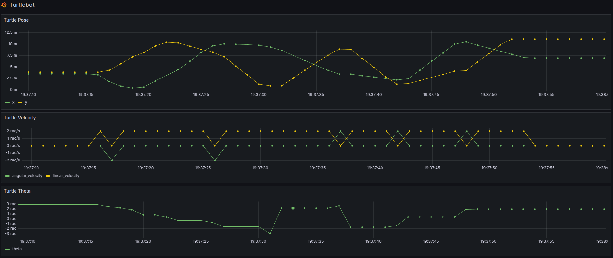

# ros2_prometheus

## Overview

ROS 2 package to expose ROS topics to Prometheus.

This ROS 2 package exposes ROS 2 topic messages as Prometheus metrics for easy monitoring.
You can then use tools like Grafana to view and analyze these metrics.



## Installation

Clone the repository in your workspace and build:

```bash
cd ~/ros2_ws/src
git clone https://github.com/lazylace37/ros2_prometheus.git
cd ../
colcon build
```

## Usage

This package runs an HTTP server that exposes topics as Prometheus metrics.

Setup the desired topics to expose in the `config/params.yaml` file. Here is an example:

```yaml
ros2_prometheus:
  ros__parameters:
    port: 8000 # The port where the HTTP server will listen
    topics: # The topics to monitor
      - /turtle1/cmd_vel
      - /turtle1/pose
```

Run the main node with the default config with:

```bash
ros2 launch ros2_prometheus test_params.launch.py
```

Then you can scape this node by editing you `prometheus.yml` config file:

```yaml
scrape_configs:
  - job_name: "ros2_prometheus"
    scrape_interval: 1s
    static_configs:
      - targets: ["localhost:8000"]
```

## Bugs & Feature Requests

Please report bugs and request features using the [Issue Tracker](https://github.com/lazylace37/ros2_prometheus/issues).
